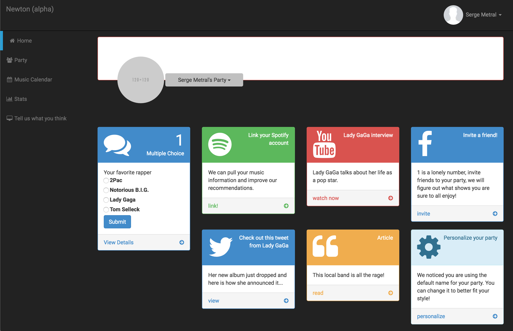

# Newton
## The social music recommendation system

If you can see this, you have been invited to this private repo.  Please do not invite anyone else to this repo without checking with the team first.  While every effort has been made to keep sensitive information out of the codebase, there is still the potential for API secrets and so forth, to exist in old commits.

### Installation
You must first install Rails.  Follow the instructions at [http://installrails.com/](http://installrails.com/) to install a local copy

### Get the source
Clone this repo.  And then run ```bundle install --without production``` to install the Ruby Gems (libraries) and the various dependencies.

### Setup environment variables
You need to specify the Facebook App ID and Secret, the app pulls these from environment variables.  You can either set these in your bash_profile, or use [Figaro](https://github.com/laserlemon/figaro).

If you want to use Figaro, run ```bundle exec figaro install```, this will create a ```config/application.yml``` file and you can put the environment variables in there.  This command automatically adds application.yml to your Git ignores, the whole point is to avoid checking in sensitive data to version control after all!

The environment variables you need to define are ```FACEBOOK_KEY``` and ```FACEBOOK_SECRET```, these are used in ```config/initializers/omniauth.rb```

**NOTE:** These only apply when running in development mode.  In production mode, the environment variables are pulled from the Heroku configuration.

### Setup your local database
You need to create the appropriate database tables in your local copy of the Newton app.  Run the following campaign:

```bundle exec rake db:migrate```

### Run the web server
If you want to develop locally (recommended), you should use the built in web server provided with Rails.  In the root directory of the app, simply run ```rails server``` and then connect to it from your web browser by navigating to ```localhost:3000```

### Production environment
The production version of the app is hosted at [http://canvasnewton.herokuapp.com](http://canvasnewton.herokuapp.com).  Heroku is a Platform-as-a-Service (PaaS) offering which makes it *very easy* to deploy and host dynamic web apps.  The appropriate git remote is added for Heroku (origin is GitHub).  Then you simply push to the Heroku, and Heroku automatically configures Rails, the gems, assets, database, etc.

If you want to deploy to Heroku, that is certainly fine.  Please ask Rishi to add you as a collaborator to the account.

### Questions

Questions are stored in the ```Questions``` table.  The corresponding model is question.rb, and corresponding controller is questions_controller.rb - as per the standard Rails conventions.

#### Schema

Data is contained in the Questions table

| Column Name | Description |
| -------------- | ----------- |
| text | The text shown to the user in the question |
| question_type | An enumeration corresponding to question type.  The enumeration is not presently defined anywhere is is implicit.  Values are: <ul><li>0 - Multiple Choice <li>1 - Yes / No, <li>2 - Rating, <li>3 - Text (where the user types in a response)</ul>
| metadata_one, metadata_two, metadata_three, metadata_four | Anything associated with the question, depends on the question type.  The intent is that these would represent answers for the multiple choice questions

The routes are the usual Rails routes for CRUD operations.  The following are the relevant URLs

| Command | URL | Operation |
|-----|-----------|-----|
| GET | http://localhost:3000/questions | List all questions |
| GET | http://localhost:3000/questions/new | Form for creating a new question |
| POST | http://localhost:3000/questions | Create a new question |
| GET | http://localhost:3000/questions/:id | Display a given question |
| GET | http://localhost:3000/questions/:id/edit | Edit a question |
| PUT | http://localhost:3000/questions/:id | Update a question |
| DELETE | http://localhost:3000/questions/:id | Delete a question |

The only URL you really have to visit is http://localhost:3000/questions to administer questions

You can also take a look at the state of your database by doing

```
rails console

> Question.all
```

Any questions or CRUD operations you've performed should reflect in your database.

### Actions

An action is something that the user gets a notification for.  This could be a question they could answer, or another action such as linking up Spotify.

#### Schema

Data is contained in the UserActions table

| Column Name | Description |
|-------------|-------------|
| user_id | User that this action is for |
| action_type | The type of action.  Currently supported values are:<ul><li>0 - Question</ul> |
| action_id | Specific to the type of action.  For questions, this is the ID of the question in the database |

The routes are the usual Rails routes for CRUD operations.  The following are the relevant URLS

| Command | URL | Operation |
|-----|-----------|-----|
| GET | http://localhost:3000/user_actions | List all user actions (for all users) |
| GET | http://localhost:3000/user_actions/new | Form for creating a new user action (for any user) |
| POST | http://localhost:3000/user_actions | Create a new user action |
| GET | http://localhost:3000/user_actions/:id | Display a given user action |
| GET | http://localhost:3000/user_actions/:id/edit | Edit a user action |
| PUT | http://localhost:3000/user_actions/:id | Update a user action |
| DELETE | http://localhost:3000/user_actions/:id | Delete a user action |

#### Assigning actions to a user

For debugging, and for the time being, actions have to manually be assigned to a user by an administrator. For now, everyone is an administrator.

Go to http://localhost:3000/user_actions/new to create a new user action.  You will need to select a user, and select a question to assign to them.


#### Viewing actions assigned to a user

You can see all the actions for a user by going to their dashboard at http://localhost:3000/NewAccount - underneath the profile, their current actions will be displayed



### Conclusion
This is still very early in development, there isn't much to say.  Please ask on the #newton channel with any questions or concerns.
