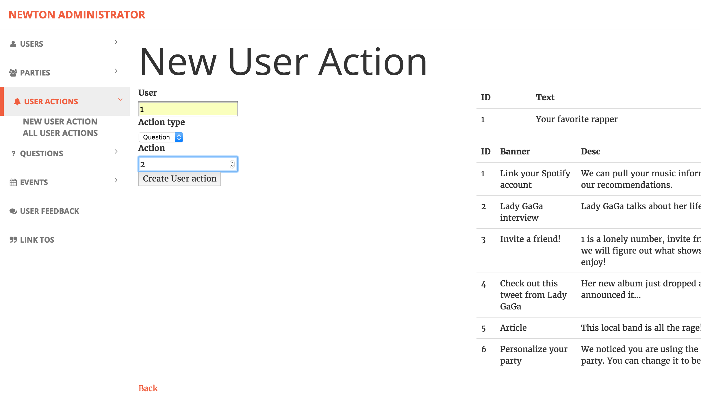
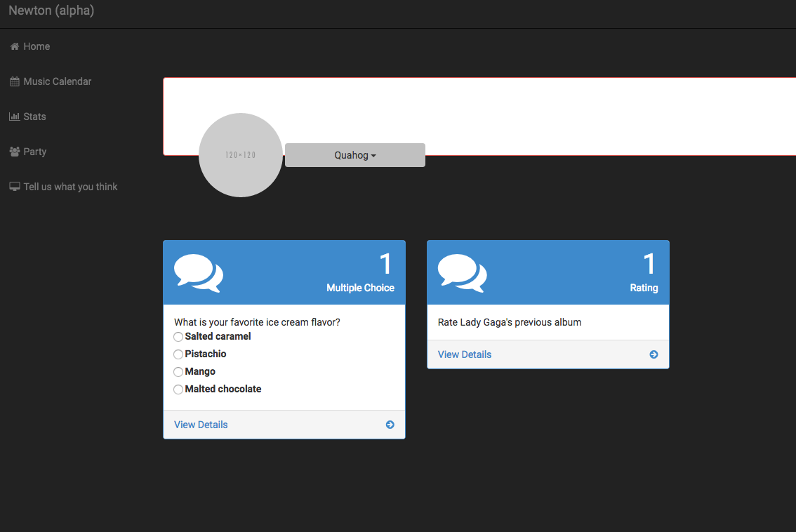

# Actions

An action is associated with a user.  This could be a question they could answer, or another action such as linking up Spotify.  These are stored in the ```UserActions``` table.

**Note:** It is envisioned that there could be actions that are not stored in this table in the future.  Eg: If a user hasn't linked their Spotify account, we already know have that information because presumably it would be indicated in the ```User``` table or somewhere similar.  So a decision would need to be made whether to actually cache an action in the ```UserActions```, or just look up if a Spotify account is linked as the logic of a given page dictates.

#### Schema

Data is contained in the ```UserActions``` table

| Column Name | Description |
|-------------|-------------|
| id      | Unique identifier of the action
| user_id | User that this action is for |
| action_type | The type of action.  Currently supported values are:<ul><li>0 - Question</ul> <ul><li>1 - Link Tos</ul> |
| action_id | Specific to the type of action.  For questions, this is the ID of the question in the database |

The routes are the usual Rails routes for CRUD operations.  The following are the relevant URLS

| Command | URL | Operation |
|-----|-----------|-----|
| GET | http://localhost:3000/user_actions | List all user actions (for all users) |
| GET | http://localhost:3000/user_actions/new | Form for creating a new user action (for any user) |
| POST | http://localhost:3000/user_actions | Create a new user action |
| GET | http://localhost:3000/user_actions/:id | Display a given user action |
| GET | http://localhost:3000/user_actions/:id/edit | Edit a user action |
| PUT | http://localhost:3000/user_actions/:id | Update a user action |
| DELETE | http://localhost:3000/user_actions/:id | Delete a user action |

#### Assigning actions to a user

For debugging, and for the time being, actions have to manually be assigned to a user by an administrator. For now, everyone is an administrator.

Go to http://localhost:3000/user_actions/new to create a new user action.  You will need to select a user, and select a question to assign to them.

You can also go to the administrator page at http://localhost:3000/administrator




#### Viewing actions assigned to a user

You can see all the actions for a user by going to their dashboard at http://localhost:3000/Home - underneath the profile, their current actions will be displayed


