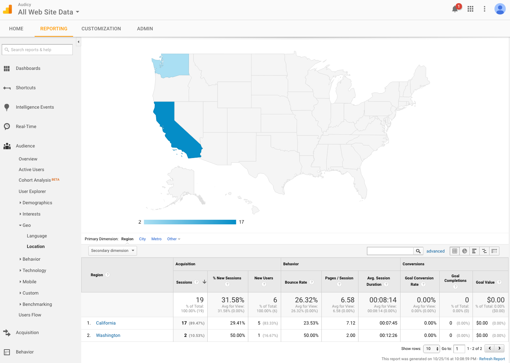
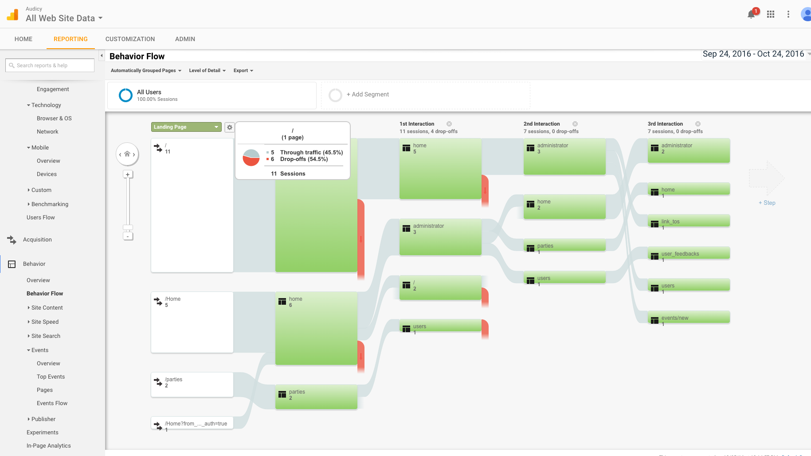
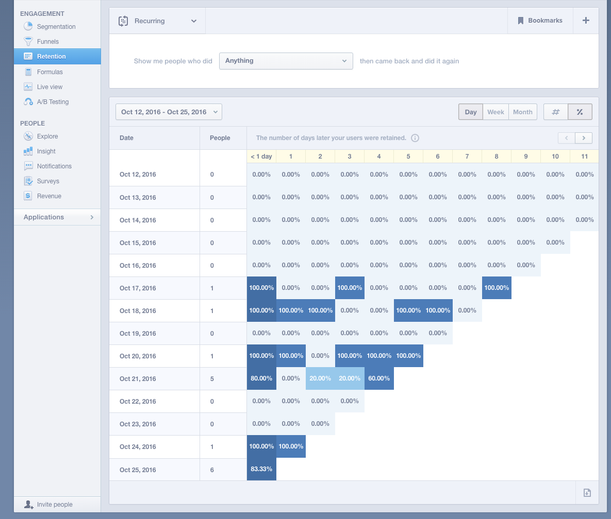
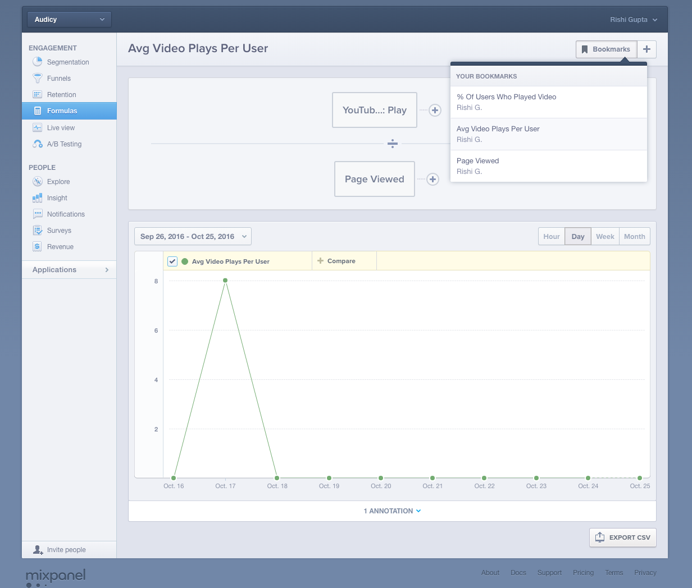

# Google Analytics

## Purpose
Google Analytics isn't used very extensively.  We use it for a few main purposes:
1. Visualization of user flow through the site
2. Rapidly see where users are visiting from
3. See how users are finding our site.  Eg: If it's from search, which search keywords?  Etc.

## Local Setup (Optional)
To get our `GOOGLE_ANALYTICS_ID`, you can login to https://www.google.com/analytics/ using our Google Apps for Business credentials.  Make sure you use the Google Analytics ID for our staging environment.

If you choose to not setup Google Analytics locally, this isn't a problem.  You just won't be able to see data update in realtime.

## KPIs
The most interesting things you can see in Google Analytics relevant to us are discussed below.

### Demographics: Geo

You can see a breakdown of where users come from here, based on Geolocation of their IP address.  You can click on a country or state to drill down further.

### Flow

You can see the flow that users take through the site, and where most of the time is spent.

# MixPanel

## Purpose
MixPanel is used for finer grained user behavior.  It can be used to answer questions such as:
1. Avg videos played per user
2. How do users drop off in the funnel of viewing http://www.audicy.us, logging in via Facebook, syncing Spotify information, etc
3. What % of users have invited at least one friend to their party

## Local Setup (Optional)
To get our `MIXPANEL_ID`, you can login to http://www.mixpanel.com.  If you don't have access to our MixPanel project, please ask Rishi for an invite.  Once you're in MixPanel, you can find `TOKEN` under Audicy Staging.  Enter that value for `MIXPANEL_ID`

## KPIs

### User Retention
You can see User Retention displayed in the standard form by clicking on the appropriate menu on the left as shown below.

### Formulas
Formulas perform arithmetic operations on events to generate KPIs.  I have pre-populated a few.  Feel free to add your own.

We will flesh out the KPIs and our analytics after release.  We are still very early in the process.
