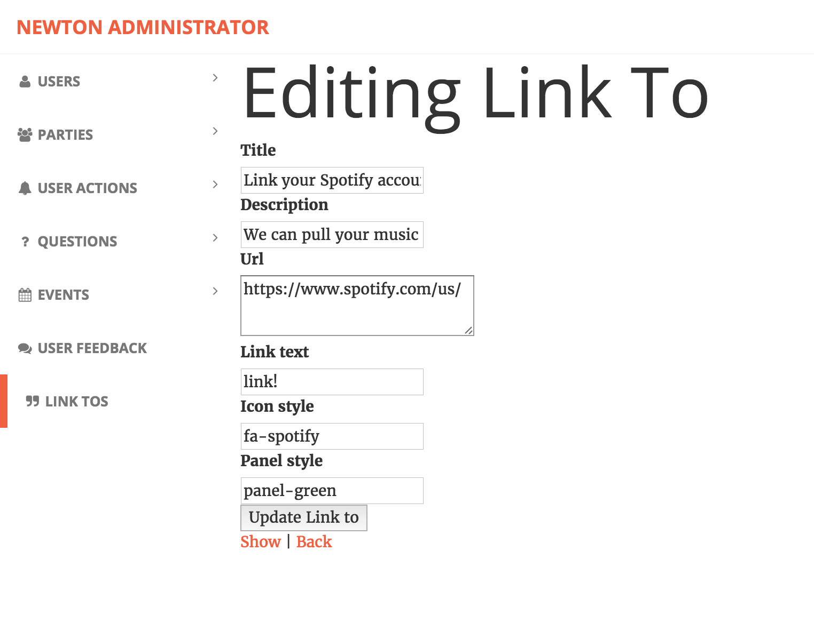

# LinkTos

LinkTos are stored in the ```LinkTos``` table.  The corresponding model is link_to.rb, and corresponding controller is link_tos_controller.rb - as per the standard Rails conventions.

The ```LinkTos``` table is global, these are all the linktos in the system, they are not necessary assigned to anyone.

To assign a linkto to someone, an ```Action``` referring to the given ```LinkTo``` must be assigned to the user.  See the [Actions](Actions.md) article for more detail.

When a link is hit, this is the route it takes: get '/action/handle_link_to' => 'new_account#handle_link_to', :as => :handle_link_to
The parameters passed are:
params[:action_id]
params[:url]

### Schema

The LinkTos table has the following structure

| Column Name | Description |
| -------------- | ----------- |
| id   | Unique identifier of the LinkTo |
| title | The title of the linkto |
| description | The text shown to the user in the link |
| url | This can be an internal link, or a link to an external website |
| link_text | The string to show for the link |
| icon_style | This allows for personalization of the link (see example) |
| panel_style | This allows for personalization of the link (see example) |


#### Example of the Spotify linkto



The only URL you really have to visit is http://localhost:3000/administrator and select linktos in the menu.

Any linkto or CRUD operations you've performed should reflect in your database.


