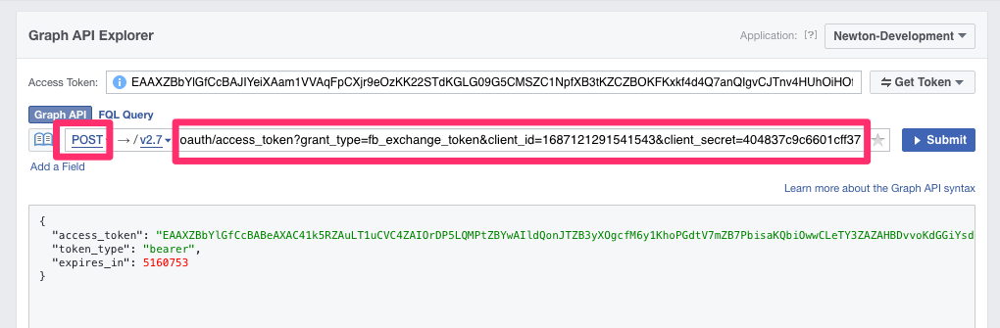
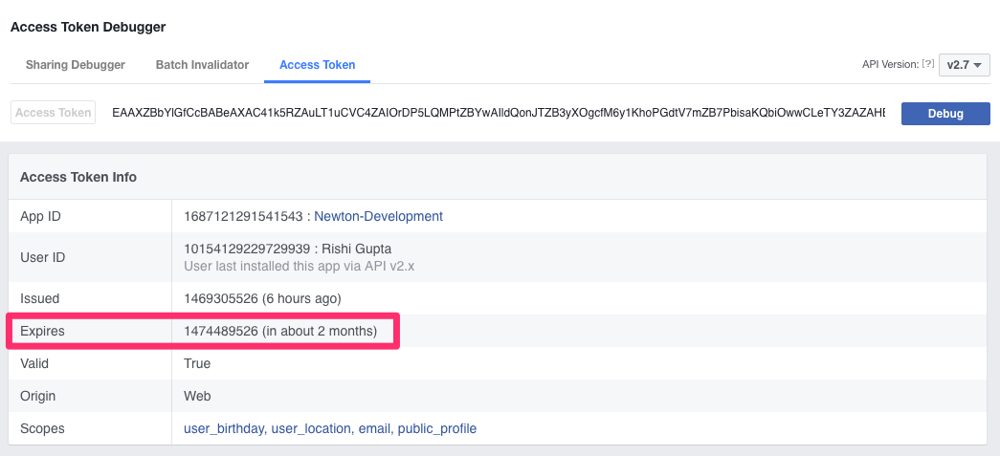

# Testing

Before you send out a pull request, please make sure that all tests pass.  If there are any errors, then please fix them or ask for help.

## Setting up test environment
You need a Facebook user to run some of the tests.  You can either use your personal Facebook account or create a test user at https://developers.facebook.com/apps/1687121291541543/roles/test-users/

Please do not re-use an existing one, since another developer might be using those.  Create a new one, and set the password to whatever you want.

Once that's done, add these new environment variables:
1. ```FB_TESTUSER_USERNAME``` should be the e-mail address for your Facebook Test account
2. ```FB_TESTUSER_PASSWORD``` should be the password for that account
3. ```FACEBOOK_AUTHORIZATION_TOKEN``` will be a valid Facebook authorization token

### Getting a Facebook Authorization token
You need a long term authorization token, which is good for 60 days.  You need a short term authorization token first, and then you trade it in for a long term authorization token.

#### Getting a short term authorization token
Go to [https://developers.facebook.com/tools/explorer/](https://developers.facebook.com/tools/explorer/) and choose the Newton-Development app as shown below


Then choose to get a user access token for the Newton-Development app as shown below


You will then have a short term token you can trade in for a long term token in the next step

#### Getting a long term authorization token
You can now trade your short term authorization token for a long term one.  The pieces of information you will need are:

- Your short term authorization token from the previous step
- Application ID
- Application Secret

App ID and Secret are from the Facebook Developer Console, and will be for the Newton-Development application.

Then you will want to use the Explorer from the above to send a POST request to ```oauth/access_token?grant_type=fb_exchange_token&client_id={application_id}&client_secret={application_secret}&fb_exchange_token={short_term_token}```

Where you replace ```{application_id}``` with the Application ID, ```{application_secret}``` with the Application Secret, and ```{short_term_token}``` with the token you observed in the previous step.

See below:



In the response you will have your long term access token.  You can verify it at the Facebook Access Token Debugger at [https://developers.facebook.com/tools/debug/accesstoken](https://developers.facebook.com/tools/debug/accesstoken)

Enter in your access token and it will tell you the expiration time.  It should be 60 days if everything went according to plan.



## Running tests
Within your project directory, run ```rake test```.  This will run all tests.  If the tests complete successfully, you'll see something like:


```
Run options: --seed 48477

# Running:

......................................

Finished in 2.484632s, 15.2940 runs/s, 28.5757 assertions/s.

38 runs, 71 assertions, 0 failures, 0 errors, 0 skips
```
